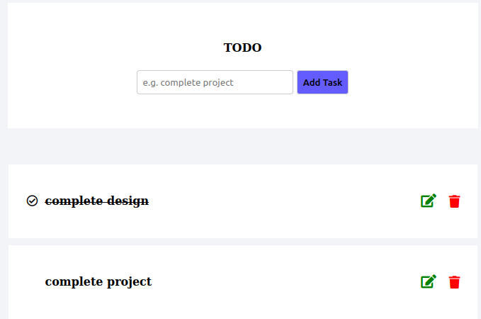

# TODO
<ul>
<li>Frontend</li>
<ol>
<li>
HTML
</li>
<li>
CSS
</li>
<li>
JS
</li>

</ol>
<li>Frontend</li>
<ol>
<li>
Node.js
</li>
</ol></ul>
 
<h2>Home Screen</h2>

<h2>Edit Screen</h2>

<h2>MongoDB Compass</h2>

